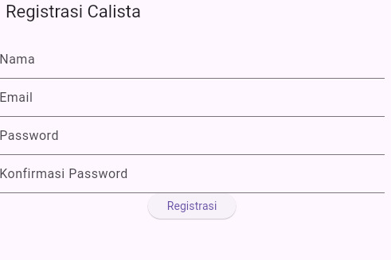
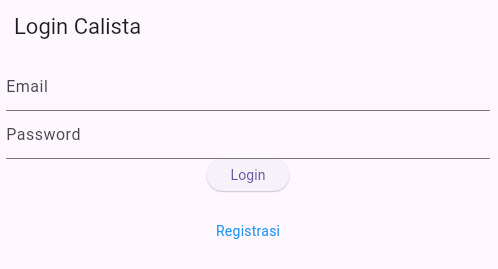
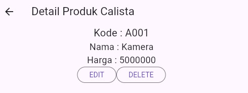
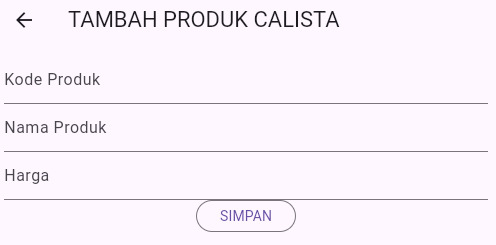

Pertemuan 4

======================================================================================================================

Pertemuan 5

1.  Proses Login
    a.  
        Penjelasan kode:
        ##  _emailTextField() --> digunakan untuk mengisi email dengan kolom email yang tersedia.
        ##  _passwordTextField() --> digunakan untuk mengisi password dengan kolom password yang tersedia.
        ##  onPressed: () --> ketika pengguna menekan tombol login, fungsi onPressed dari _buttonLogin() dipanggil.
        ##  _formKey.currentState!.validate() --> memanggil validator pada setiap kolom dalam form, jika ada input yang tidak valid maka dialog kesalahan akan ditampilkan.
        ##  setState(() {
            _isLoading = true;
            });
            --> jika validasi berhasil, sebelum mengirimkan data ke backend status loading diubah menjadi true.
        ##  _submit() --> mengirim permintaan login dengan fungsi _submit().
        ##  LoginBloc.login --> mengirimkan email dan password ke backend untuk autentikasi.
        ##  UserInfo() --> menyimpan token dan user ID untuk autentikasi.
    b.  
        ##  showDialog(
            context: context,
            barrierDismissible: false,
            builder: (BuildContext context) => SuccessDialog(
                description: "Anda Berhasil Login!",
                okClick: () {
                Navigator.pop(context);
                },
            ));
            --> kode di atas menunjukan bahwa login berhasil dilakukan.
        
        ##  showDialog(
            context: context,
            barrierDismissible: false,
            builder: (BuildContext context) => const WarningDialog(
                description: "Login gagal, silahkan coba lagi",
            ));
            --> kode di atas menunjukan bahwa login gagal dilakukan.
2.  List Produk
    a.  
        ##  child: GestureDetector --> mengarahkan pengguna ke halaman ProdukForm ketika ditekan.
        ##  LogoutBloc.logout() --> untuk menghapus sesi pengguna dan pengguna akan diarahkan kembali ke halaman login.
        ##  FutureBuilder --> mengelola status asinkron saat mengambil data produk.
        ##  future: ProdukBloc.getProduks() --> memanggil metode untuk mendapatkan daftar produk dari backend.
        ##  ? ListProduk(list: snapshot.data) --> menampilkan data produk yang diambil.
        ##  CircularProgressIndicator() --> jika data belum siap maka akan menampilkan indikator loading.
        ##  ListView.builder --> membangun list secara dinamis berdasarkan jumlah item dalam daftar.
        ##  itemCount: list == null ? 0 : list!.length --> mwngatur jumlah item dalam daftar; jika daftar null, akan bernilai 0.
        ##  itemBuilder --> membangun item untuk setiap produk dengan memanggil kelas ItemProduk.
        ##  builder: (context) => ProdukDetail(produk: produk))); --> mengarahkan pengguna ke halaman detail produk (ProdukDetail) ketika item ditekan.
        ##  ListTile --> penataan elemen-elemen dalam card.
        ##  produk.namaProduk --> menampilkan nama produk.
        ##  produk.hargaProduk --> menampilkan harga produk.
3.  Tambah Produk
    a.  
        ##  final _formKey = GlobalKey<FormState>() --> untuk mengelola status dari formulir dan memvalidasi input pengguna.
        ##  bool _isLoading = false --> menunjukkan apakah proses pengiriman data sedang berlangsung.
        ##  tombolSubmit --> tombol untuk menambahkan produk.
        ##  _kodeProdukTextboxController --> membuat textbox untuk menginput kode produk.
        ##  _namaProdukTextboxController --> membuat textbox untuk menginput nama produk.
        ##  _hargaProdukTextboxController --> membuat textbox untuk menginput harga produk.
        ##  ProdukBloc.addProduk(produk: createProduk) --> untuk menambahkan produk ke database. 
4.  Detail Produk
    a.  
        ##  "Kode Produk: ${widget.produk!.kodeProduk}" --> menampilkan kode produk.
        ##  "Nama Produk: ${widget.produk!.namaProduk}" --> menampilkan nama produk.
        ##  "Harga: Rp ${widget.produk!.hargaProduk}" --> menampilkan harga produk.
        ##  _tombolHapusEdit() --> tombol untuk mengedit dan menghapus produk.
        ##  builder: (context) => ProdukForm(produk: widget.produk!) --> berisi tombol EDIT yang ketika tombol ditekan aplikasi akan berpindah ke halaman ProdukForm dengan mengirimkan objek produk yang akan diedit.
        ##  onPressed: () => confirmHapus() --> berisi tombol DELETE yang Ketika tombol hapus ditekan memanggil fungsi confirmHapus() untuk mengkonfirmasi penghapusan produk.
        ##  AlertDialog alertDialog = AlertDialog --> menampilkan dialog yang menanyakan apakah pengguna yakin ingin menghapus produk.
        ##  ProdukBloc.deleteProduk(id: int.parse(widget.produk!.id!)) --> menghapus produk berdasarkan ID-nya.
        ##  builder: (context) => const ProdukPage() --> jika hapus berhasil, aplikasi akan kembali ke halaman ProdukPage.
    b.  
5.  Ubah Produk
    a.  
        ##  _kodeProdukTextboxController.text = widget.produk!.kodeProduk! --> kolom yang berisi kode produk dengan data yang berasal dari database.
        ##  _namaProdukTextboxController.text = widget.produk!.namaProduk! --> kolom yang berisi nama produk dengan data yang berasal dari database.
        ##  _hargaProdukTextboxController.text = widget.produk!.hargaProduk.toString() --> kolom yang berisi harga produk dengan data yang berasal dari database.
        ##  Produk updateProduk = Produk(id: widget.produk!.id!) --> untuk membuat objek produk baru yang siap untuk diperbarui, dengan ID yang sesuai untuk menandai produk mana yang harus diubah dalam database.
        ##  ProdukBloc.updateProduk(produk: updateProduk) --> memperbarui informasi produk.

